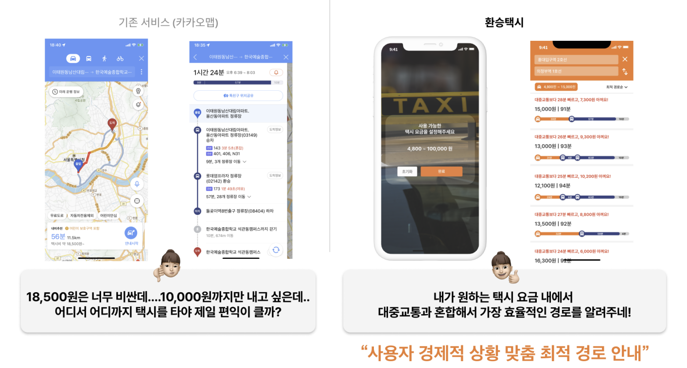

# Nemothon
2023 카카오 모빌리티 해커톤: 네모톤에 참가하여 작업한 내용입니다.  
원하는 택시 요금 내에서 대중교통과 혼합해 가장 효율적인 경로를 안내해주는 서비스를 기획하고 구현하였습니다.  
 
# 프로토타입

프로토타입에서 저는 아래의 순서로 작업을 진행하였습니다.  
<ol>
  <li>프론트엔드 측에서 고객이 설정한 택시비 범위를 전달 받습니다.</li>
  <li>공공데이터포털 API를 통해 출발지점의 대중교통 대기시간을 전달 받습니다.</li>
  <li>각 중간지점까지의 택시비 정보를 카카오모빌리티 API를 통해 전달 받습니다.</li>
  <li>각 중간지점까지의 대중교통 이동시간과 택시비의 비율을 구하여 효율 순서를 구합니다.</li>
  <li>효율 순서대로 정렬된 Json 데이터를 프론트엔드에 전달합니다.</li>
</ol>
